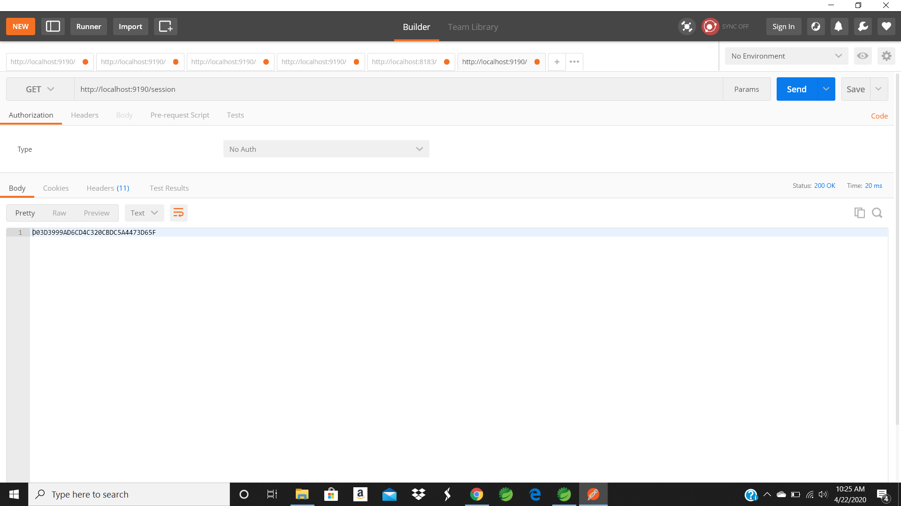
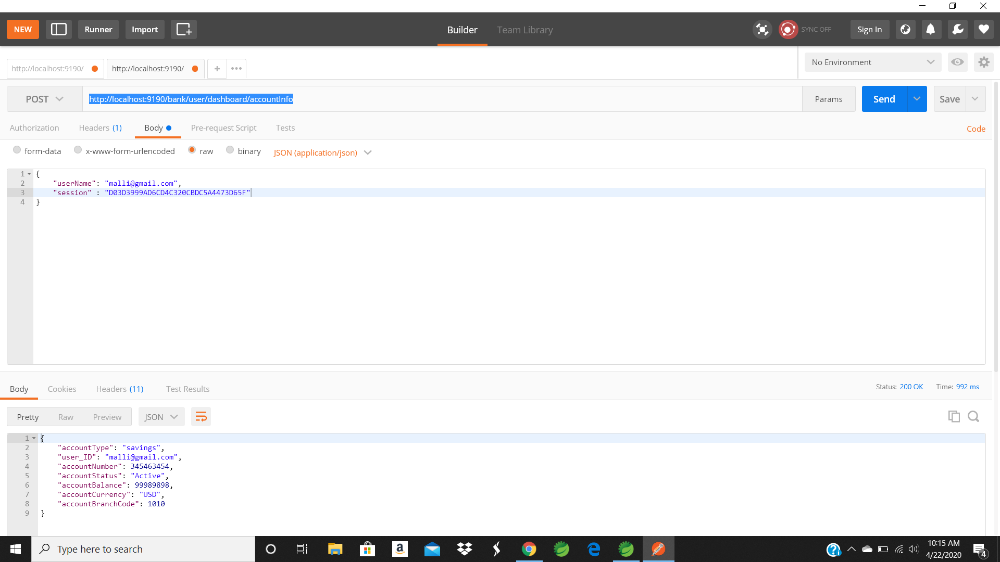
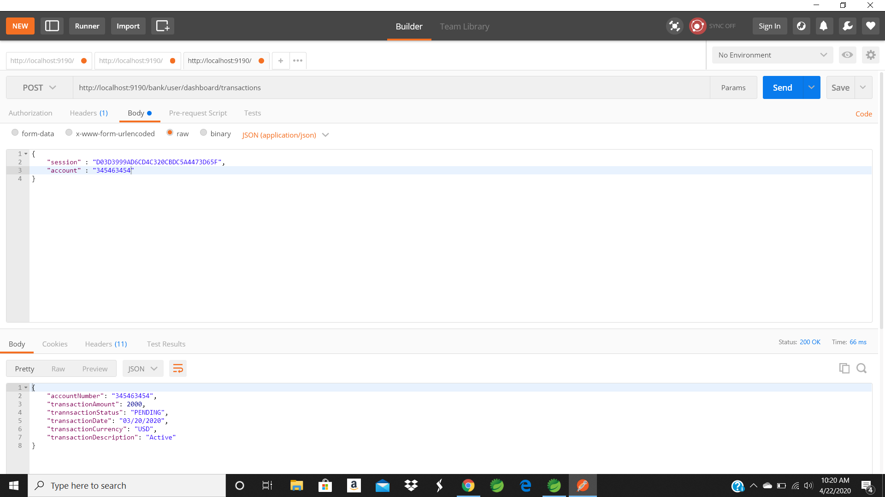
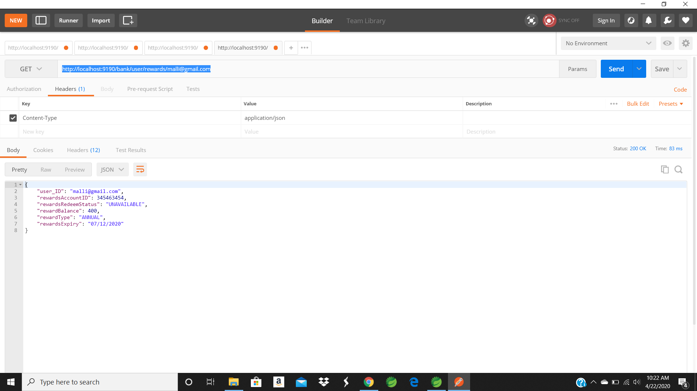
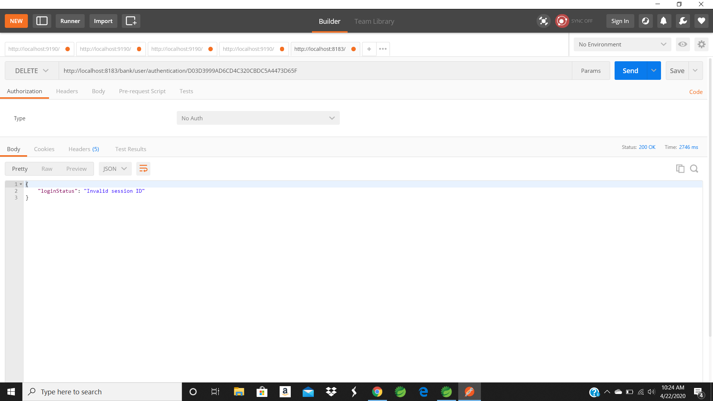
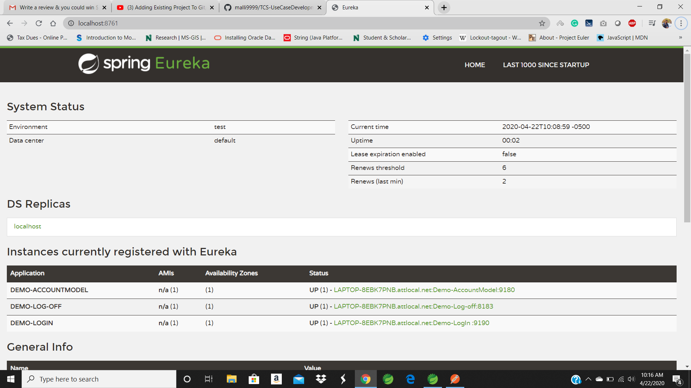

# TCS-UseCaseDevelopment
## Description
##### In this Use we have three spring boot Application 
1. The First Application is for User Login.
2. The Second Applicationis for Account Inforamtion.
3. The Third Application is for Logoff.

## User Login Apllication
* The user can log in to the Application with the userName and Password. 
* The Log in details are validated against details stored in the Database. 
* If the user details are corect the user can successfully log in to the system. 
* If the user details are incorrect, the user will get an Error Page. 
* Whenever the user Login into the application, A session is generated is generated for that user. 
* The session ID remains until the user logout from the system or any failue in the system.

## Account Inforamtion
* Once the user successfully loged in into the system.
* we can retrive the Account Information of the user with the use name and session ID generated during the log in.

## Transaction Information
* We can retrive the User Transaction details with sssion ID and Account Number.

## Rewards Information
* We can retrive the Rewards for particular  user based on the Username.

## Logoff
* The user can Logout from the System with the session ID and update the session Status to Inactive.
* If the session is not active, will get an error message stating invalid SessionID.

## Eureka
* We will register all three application in the Eureka

